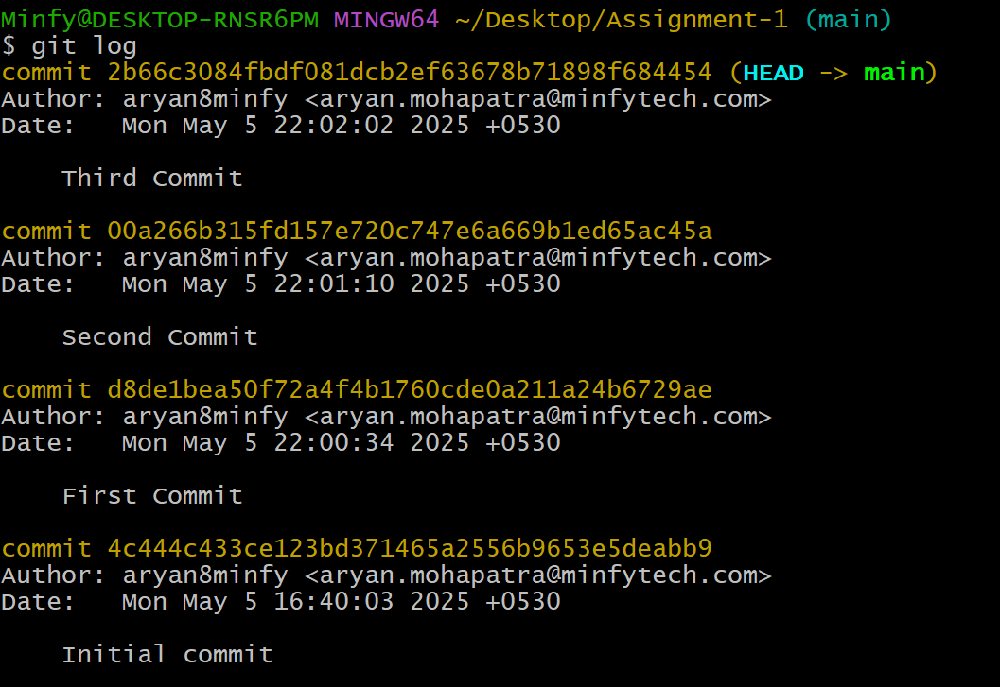
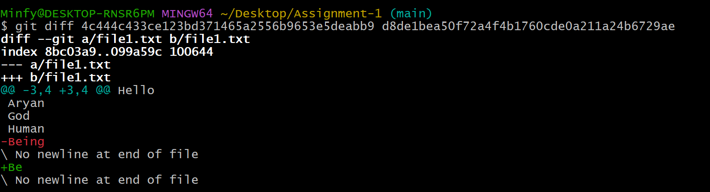
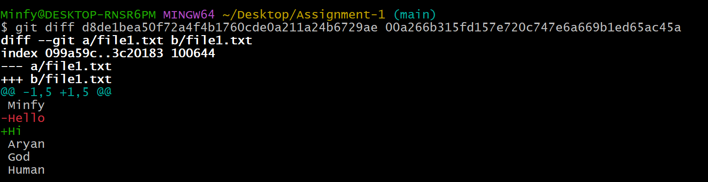
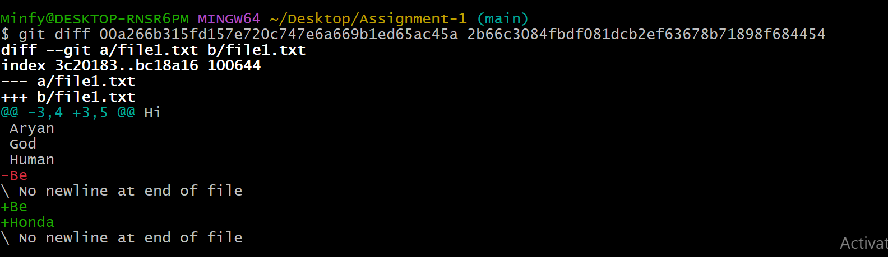

## Repository with commit history
    Initialized the repository with git init command with the inital commit as "Initial Commit"
    a. First Commit : Changed the content of the file1 i.e. being to be [with the commit "First Commit]
    b. Second Commit : Changed the content of the file1 i.e. Hello to Hi [with the commit "Second Commit]
    c. Third Commit : Added new line in the file1 i.e. Honda [with the commit "Third Commit"]

## Screenshot of the git log output
    
    
    
    

## Brief explanation of the changes made in each commit
    Initialized the repository with git init command with the inital commit as "Initial Commit"
    a. First Commit : Changed the content of the file1 i.e. being to be [with the commit "First Commit]
    b. Second Commit : Changed the content of the file1 i.e. Hello to Hi [with the commit "Second Commit]
    c. Third Commit : Added new line in the file1 i.e. Honda [with the commit "Third Commit"]